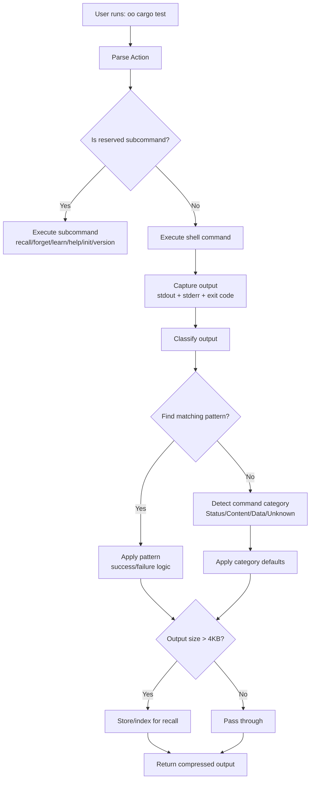

# Architecture

This document describes the architecture of `oo` — how commands flow through the system and what each module is responsible for.

## Overview

oo wraps shell commands, analyzes their output, and provides context-efficient results to AI agents. The core flow is:



## Core Flow

### 1. Command Execution

**Module**: [`src/exec.rs`](../src/exec.rs)

Every command (whether a reserved subcommand or shell command) goes through execution:

1. Parse the user's input with `clap`
2. Intercept `_learn_bg` internal commands (for background pattern learning)
3. Dispatch to the appropriate handler:
   - Reserved subcommands → built-in handlers
   - Everything else → shell command execution

**Key functions**:
- `run(args)` — Execute a shell command and capture stdout, stderr, exit code
- `CommandOutput` — Struct holding captured output

### 2. Output Classification

**Module**: [`src/classify.rs`](../src/classify.rs)

The classification engine decides how to present output to the agent:

**Input**: `CommandOutput` + command string + patterns

**Possible outcomes**:
- **Failure** (exit code ≠ 0): Filtered error output (tail/head/grep/between)
- **Passthrough** (success, <4KB): Verbatim output
- **Success** (success, <4KB, pattern match): Compressed summary
- **Large** (success, >4KB, no pattern): Indexed for recall

**Decision tree**:
1. Exit code zero? No → Failure
2. Output < 4KB? Yes → Passthrough
3. Pattern matches? Yes → Success (extract summary)
4. Detect category → apply category defaults

### 3. Pattern Matching

**Module**: [`src/pattern/`](../src/pattern/)

Patterns define how to compress command output using regex.

**Components**:
- `mod.rs` — Pattern struct, matching logic
- `builtins.rs` — 10 built-in patterns for common tools
- `toml.rs` — Load user-defined patterns from `~/.config/oo/patterns/`

**Pattern structure**:
```rust
Pattern {
    command_match: Regex,  // matches command line (e.g., "cargo test")
    success: Option<SuccessPattern>,  // how to extract summary on success
    failure: Option<FailurePattern>,  // how to filter errors on failure
}
```

**Matching priority**: User patterns → Built-in patterns → Category defaults

### 4. Category Detection

**Module**: [`src/classify.rs`](../src/classify.rs) (auto-detection)

Commands are auto-categorized to determine default behavior:

| Category | Examples | Default Behavior |
|----------|----------|------------------|
| Status | `cargo test`, `pytest`, `eslint`, `cargo build` | Quiet success (large output) |
| Content | `git show`, `git diff`, `cat`, `bat` | Always passthrough (never index) |
| Data | `git log`, `git status`, `gh api`, `ls` | Index for recall (large output) |
| Unknown | Anything else (curl, docker, etc.) | Passthrough (safe default) |

Categories are detected by regex patterns in the command string.

### 5. Storage & Recall

**Module**: [`src/store.rs`](../src/store.rs)

Large outputs that don't match patterns are stored for full-text retrieval.

**Storage backends**:
- `SqliteStore` (default) — SQLite database in `~/.local/share/.oo/`
- `VipuneStore` (feature flag) — Optional semantic search via Vipune

**Operations**:
- `index()` — Store output with metadata
- `search()` — Full-text search across indexed outputs
- `clear_session()` — Delete all outputs for current session

**Session tracking**:
- [`src/session.rs`](../src/session.rs) — Session ID (parent PID) and project ID (git remote or directory name)

### 6. LLM Learning

**Module**: [`src/learn.rs`](../src/learn.rs)

`oo learn` runs a command, observes its output, then generates a pattern via LLM.

**Process**:
1. Execute command normally
2. Capture command, output, exit code
3. Spawn background process
4. Send to Anthropic API (requires `ANTHROPIC_API_KEY`)
5. Parse response as TOML pattern
6. Write to `~/.config/oo/patterns/<label>.toml`

**Status tracking**: Background learn results are written to a status file and displayed on the next `oo` invocation.

## Module Responsibilities

| Module | Responsibility | Key Types/Functions |
|--------|---------------|---------------------|
| [`src/main.rs`](../src/main.rs) | CLI entry point, subcommand dispatch | `Cli`, `main()` |
| [`src/exec.rs`](../src/exec.rs) | Shell command execution, output capture | `run()`, `CommandOutput` |
| [`src/classify.rs`](../src/classify.rs) | Classification engine, category detection | `classify()`, `detect_category()` |
| [`src/pattern/mod.rs`](../src/pattern/mod.rs) | Pattern matching, extraction logic | `find_matching()`, `extract_summary()` |
| [`src/pattern/builtins.rs`](../src/pattern/builtins.rs) | 10 built-in patterns | `BUILTINS`, `pytest_pattern()`, `cargo_test_pattern()` |
| [`src/pattern/toml.rs`](../src/pattern/toml.rs) | Load/parse user patterns from TOML | `load_user_patterns()`, `parse_pattern_str()` |
| [`src/store.rs`](../src/store.rs) | Storage backends (SQLite, Vipune) | `Store` trait, `SqliteStore` |
| [`src/session.rs`](../src/session.rs) | Session and project ID detection | `session_id()`, `project_id()` |
| [`src/learn.rs`](../src/learn.rs) | LLM integration, background pattern learning | `run_background()`, `LearnConfig` |
| [`src/error.rs`](../src/error.rs) | Unified error types | `Error` enum |
| [`src/commands.rs`](../src/commands.rs) | CLI command handlers (private) | `cmd_run()`, `cmd_recall()`, etc. |
| [`src/help.rs`](../src/help.rs) | Help text generation | Help templates |
| [`src/init.rs`](../src/init.rs) | `oo init` hook generation | Hook file creation |
| [`src/util.rs`](../src/util.rs) | Utilities (truncation, formatting) | `truncate_lines()`, human-readable sizes |

## Key Design Decisions

### 1. Passthrough by default

Unknown commands pass through unchanged (<4KB) or get indexed (>4KB). This is safe — users see what they expect unless a pattern explicitly overrides behavior.

### 2. Patterns are opt-in overrides

User patterns in `~/.config/oo/patterns/` always take priority over built-ins. This lets users customize behavior without modifying oo itself.

### 3. Category-based fallbacks

When no pattern matches, category detection provides sensible defaults. This prevents indexing of content commands (git show, diff) where agents need the actual output.

### 4. SQLite by default

SQLite requires no setup, is portable, and provides sufficient full-text search for most use cases. Vipune is an optional upgrade path for semantic search.

### 5. Background learning

Pattern learning runs in the background after the command completes. This doesn't block the user; results appear on the next `oo` invocation.

### 6. Session-scoped storage

Indexed outputs are scoped to a session (parent PID). `oo forget` clears the current session, so agents start fresh without leftover data.

## Reserved Subcommands

These are built-in commands (not shell commands):

| Subcommand | Handler | Purpose |
|------------|---------|---------|
| `recall` | `cmd_recall()` | Search indexed outputs via full-text query |
| `forget` | `cmd_forget()` | Clear all indexed outputs for current session |
| `learn` | `cmd_learn()` | Run command and generate pattern via LLM |
| `help` | `cmd_help()` | Show help text or fetch cheat sheet |
| `init` | `cmd_init()` | Generate `.claude/hooks.json` and AGENTS.md snippet |
| `version` | Built-in to clap | Print version |
| `_learn_bg` | `run_background()` | Internal command for background learning |

Everything else is treated as a shell command to execute.

## Extension Points

### Adding a new built-in pattern

1. Add pattern to `src/pattern/builtins.rs`
2. Write unit tests in the same file
3. Consider adding integration test in `tests/integration.rs`

### Adding a new storage backend

1. Implement `Store` trait in `src/store.rs`
2. Add feature flag to `Cargo.toml`
3. Update storage initialization in main command flow

### Adding a new reserved subcommand

1. Add handler function to `src/commands.rs`
2. Dispatch in `parse_action()` in `src/commands.rs`
3. Add tests in `tests/integration.rs`

## Performance Considerations

- **Output size**: Only outputs >4KB are considered for compression/indexing. Small outputs pass through immediately.
- **Pattern matching**: Compiled regexes are cached. Pattern matching is O(n) where n is the number of built-in patterns (currently 10).
- **Storage**: SQLite indexes on `project_id` and `session` for fast queries.
- **LLM learning**: Runs in background; doesn't block command execution.

## Security Considerations

See [Security Model](security-model.md) for details on:

- Trust assumptions
- Local data storage
- API key handling
- Command injection prevention

## Further Reading

- [Testing Guide](testing.md) — How to test each component
- [Patterns](patterns.md) — Creating custom patterns
- [Learning Patterns](learn.md) — LLM-based pattern generation